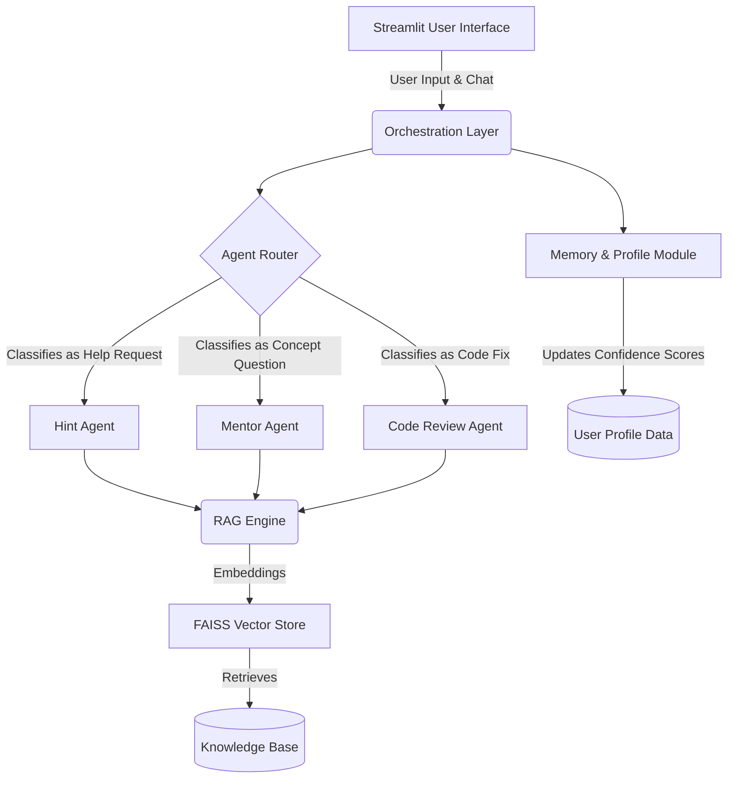
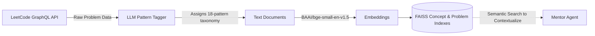
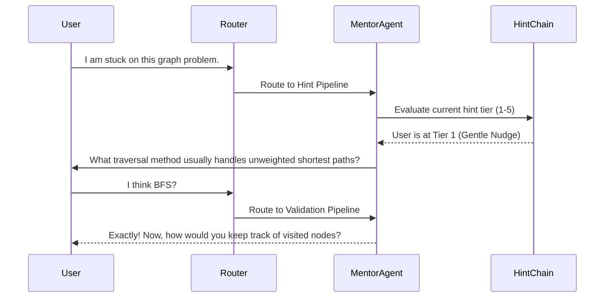

# AlgoSage: Your Personalized, AI-Powered Socratic Coding Guide

Welcome to DSA Mentor! This is not just another solution generator. Instead, it is your personal LeetCode and Data Structures & Algorithms (DSA) coach. Driven by an advanced Retrieval-Augmented Generation (RAG) pipeline and a robust agentic architecture, this mentor guides you to the correct answer through Socratic questioning rather than just giving you the code.

By running entirely locally with tools like Ollama or securely through APIs like Google Gemini, you are guaranteed privacy without compromising on capability. 

---

## The Core Philosophy: The Socratic Method

We believe that true learning comes from struggling with a problem and discovering the pattern, not from copying and pasting solutions. The heart of DSA Mentor is a specialized "Hint Chain" that strictly enforces a 5-tier hint wall. It analyzes your code, determines exactly where your logic breaks down, and provides a customized nudge in the right direction. 

If you are stuck, the mentor does not give you the answer. It asks you the right question.

---

## Architectural Deep Dive

To achieve this level of understanding and personalization, DSA Mentor relies on a sophisticated internal architecture. Here is a look under the hood.

### 1. High-Level System Design

The system is separated into logical layers, ensuring that data ingestion, memory, agent orchestration, and the user interface all operate seamlessly together.



### 2. The Data Ingestion & Retrieval (RAG) Pipeline

Before the mentor can help, it needs to understand the universe of DSA problems and concepts. It pulls your history directly from LeetCode, parses it using a Large Language Model (LLM) to extract fundamental patterns, and stores it locally for hyper-fast retrieval.



### 3. The Hint Enforcement Mechanism (Agent Workflow)

When you ask for help, the router directs your query to the Hint Chain. This acts as an "anti-cheating" firewall, ensuring you engage deeply with the problem by answering scaffolding questions.



---

## Quick Start & Setup Guide

Ready to get started? Running DSA Mentor locally is incredibly straightforward.

### Prerequisites

1. **Python 3.10 or higher**
2. **Ollama** installed and running on your device (if you prefer local execution)
3. Download a local model if using Ollama:
   ```bash
   ollama pull llama3.2
   ```

### Installation Steps

1. **Clone the repository:**
   ```bash
   git clone https://github.com/TarushB/dsa-mentor.git
   cd dsa-mentor
   ```

2. **Create and activate a virtual environment:**
   ```bash
   python -m venv venv
   source venv/bin/activate   # On Linux/Mac
   # venv\Scripts\activate    # On Windows
   ```

3. **Install the required dependencies:**
   ```bash
   pip install -r requirements.txt
   ```

4. **Configure your environment variables:**
   ```bash
   cp .env.example .env
   ```
   Open the `.env` file to add your optional Gemini API key or your LeetCode authentication cookies.

5. **Run the Streamlit Application:**
   ```bash
   streamlit run app.py
   ```

---

## Optional: Ingesting Custom Data

The mentor comes pre-configured, but you can feed it your own fresh data from LeetCode or rebuild the vector databases manually.

**Option A: Pull Data directly from LeetCode:**
```bash
python scripts/ingest_leetcode.py --mode graphql --username YOUR_USERNAME
```

**Option B: Rebuild the Offline Vector Database:**
```bash
python scripts/build_concept_index.py 
python scripts/build_problem_index.py
```

---

## Inside the Repository: Project Phases

We have built DSA Mentor in structured phases to ensure stability and focus.

### Phase 1: Data Ingestion and Automation
- **LeetCode Integration (`ingestion/leetcode_client.py`)**: A robust GraphQL scraper that pulls your solving history. Includes a CSV fallback method.
- **Pattern Parsing (`ingestion/problem_parser.py`)**: Utilizes an LLM to accurately categorize arbitrary problems into an 18-pattern standard taxonomy system.
- **Profile Generation (`ingestion/profile_builder.py`)**: Maintains a continuous offline profile (`user_data.json`) that actively computes and tracks your confidence levels across various algorithmic topics to provide tailored advice.

### Phase 2: Knowledge Retrieval (RAG)
- **Local Embeddings (`rag/embeddings.py`)**: Manages the FAISS indexing system by generating robust text embeddings completely local to your machine, keeping your learning data locked to your disk.
- **Context Assembly (`rag/retrievers.py`)**: Pulls together the most relevant problem contexts and semantic technical concepts based on your current question to give the LLM perfect context.

### Phase 3: Agent Orchestration
- **The Router (`agents/router.py`)**: Rapidly classifies your messages into specific action pipelines (e.g., Code Fix vs. Conceptual Hint).
- **The Hint Chain (`agents/hint_chain.py`)**: Protects your learning process by enforcing the strict 5-tier hint wall.
- **The Core Mentor (`agents/mentor_agent.py`)**: The central brain that collects your stats, queries databases, prompts the LLMs, and handles complex logical routing edge cases gracefully.

### Phase 4: Modern User Experience
- **Streamlit Frontend (`app.py`)**: A gorgeous, dark-mode user interface featuring sidebar stat tracking elements, beautifully rendered radar charts for visual representation of your proficiency, persistent session memory to continue where you left off, and highly legible markdown code rendering support.

---

## What is Next? (Future Enhancements)

Our journey is not over. We are actively working on amazing new features to elevate your learning experience:

- **Integrated Ace Editor**: We plan to embed `streamlit-ace` directly into the customized chat structure, allowing you to run, edit, and test code live within the app interface without managing extra windows.
- **Advanced Hallucination Guards**: Ensuring that row numbers and code references generated by the conversational LLM are heavily validated against the actual stored codebase and your inputs.
- **Session Vector Management**: Implementing automatic vector cleanup for stale or incredibly ancient chat sessions to keep processing speed blazing fast and memory usage exceptionally light on your hardware.

---

## Technology Stack Overview

We have carefully chosen our entire technology stack to radically balance maximum performance, zero cost, and strict data user privacy.

| Component | Technology | Cost / Model |
|-----------|-----------|------|
| User Interface | Streamlit with Tailored Custom CSS | Free Open Source |
| Language Models | Ollama (Local) or Google Gemini API | Free Local Compute / Freemium Cloud |
| Embeddings Engine | BAAI/bge-small-en-v1.5 | Free / Runs Locally Offline |
| Core Vector Database| FAISS (CPU Optimized Edition) | Free Open Source |
| NLP Pipeline Framework | LangChain | Free Open Source |

Thank you so much for exploring and supporting DSA Mentor! Happy coding, never stop learning, and may your algorithms always run in perfectly optimal time bounds!
